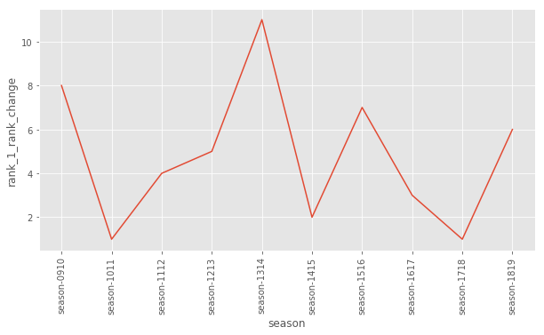

# Rivalry index - EPL

Watching Liverpool and Man City fighting for the top spot in the the ongoing EPL and bored on a weekend I got curious to come up with metrics to quantify such intense rivalry across the length of a long season. Who likes a dull league where the top spot gets sealed only after a few games. Metrics are useful as an analysis tool and a way to look at subjective elemtents of past data (competition in the league in this case). These representations can be useful in certain modeling tasks such as a regression model of TRP (viewership etc).

I used the historical EPL data here: https://datahub.io/sports-data/english-premier-league to compute the metrics over previous seasons. The original data as shown below has information about teams and results of each match. I aggreated this data and prepared results table at the end of each round.

__Metric 1__ (_Rank change_): <br>
Given the results table over two consequetive weeks this metric computes the the sum of changes in the leader board positions compared with the previous week. For example given this data over two weeks:


| Week-1 | Week-2 |
| --- | --- |
| a | a |
| b | c |
| c | d |


the metric outputs a value of 2 for round 2.

__Metric-2__ (_Bag size_): <br>
This metric computes how many teams are within a certain points difference of each position, summed across every position on the leader board. The intuition behind the metric goes that more the teams are closer to each other in term of number of points more the interest in the league is alive (Man United, Arsenal, Tottenham and Chelsea fighting for the position in top 4 and a chance to play the champions league. Consider the leaderboard for week k.


| Club | Points |
| --- | --- |
| a | 80 |
| b | 78 |
| c | 75 |
| d | 70 |


with the points diff of 3 (one match) the metric outputs a value of (1 + 2 + 1 + 0) = 4 for this round. a's bag has b it; b has a and c while d has 0.

__Metric-3__ (_Weighted bag size_): <br>

Bag sizes are inverse weighted as per the position on the leaderboard. Intuitively there is most interest in fight for higher ranks up the leaderboard (other weights could be used to focus more on certain positions etc).

The plots below (aggregated across season and variation in a single season) compare each metric values across seasons and for sections of the leaderboard (top position, top 4, relegation zone and full leaderboard) to derive interesting insights across seasons. 

Invite the subject matter experts and fans to comment send feedback/validate/in-validate the findings in the plots for this fun little project.

Toggle the button below to view code for implemenation of these metrics using pandas and numpy.


```python
from IPython.display import HTML

HTML('''<script>
code_show=true; 
function code_toggle() {
 if (code_show){
 $('div.input').hide();
 } else {
 $('div.input').show();
 }
 code_show = !code_show
} 
$( document ).ready(code_toggle);
</script>
<form action="javascript:code_toggle()"><input type="submit" value="Click here to toggle on/off the raw code."></form>''')
```


<script>
code_show=true; 
function code_toggle() {
 if (code_show){
 $('div.input').hide();
 } else {
 $('div.input').show();
 }
 code_show = !code_show
} 
$( document ).ready(code_toggle);
</script>
<form action="javascript:code_toggle()"><input type="submit" value="Click here to toggle on/off the raw code."></form>


```python
import pandas as pd
import numpy as np
import seaborn as sns
import matplotlib.pyplot as plt

import matplotlib.style as style
style.use('ggplot')
```


```python
df = pd.read_csv("data/season-1011_csv.csv")
```


```python
df.head()
```


<div>
<style scoped>
    .dataframe tbody tr th:only-of-type {
        vertical-align: middle;
    }

    .dataframe tbody tr th {
        vertical-align: top;
    }

    .dataframe thead th {
        text-align: right;
    }
</style>
<table border="1" class="dataframe">
  <thead>
    <tr style="text-align: right;">
      <th></th>
      <th>Date</th>
      <th>HomeTeam</th>
      <th>AwayTeam</th>
      <th>FTHG</th>
      <th>FTAG</th>
      <th>FTR</th>
      <th>HTHG</th>
      <th>HTAG</th>
      <th>HTR</th>
      <th>Referee</th>
      <th>...</th>
      <th>HST</th>
      <th>AST</th>
      <th>HF</th>
      <th>AF</th>
      <th>HC</th>
      <th>AC</th>
      <th>HY</th>
      <th>AY</th>
      <th>HR</th>
      <th>AR</th>
    </tr>
  </thead>
  <tbody>
    <tr>
      <th>0</th>
      <td>2010-08-14</td>
      <td>Aston Villa</td>
      <td>West Ham</td>
      <td>3</td>
      <td>0</td>
      <td>H</td>
      <td>2</td>
      <td>0</td>
      <td>H</td>
      <td>M Dean</td>
      <td>...</td>
      <td>11</td>
      <td>2</td>
      <td>15</td>
      <td>15</td>
      <td>16</td>
      <td>7</td>
      <td>1</td>
      <td>2</td>
      <td>0</td>
      <td>0</td>
    </tr>
    <tr>
      <th>1</th>
      <td>2010-08-14</td>
      <td>Blackburn</td>
      <td>Everton</td>
      <td>1</td>
      <td>0</td>
      <td>H</td>
      <td>1</td>
      <td>0</td>
      <td>H</td>
      <td>P Dowd</td>
      <td>...</td>
      <td>2</td>
      <td>12</td>
      <td>19</td>
      <td>14</td>
      <td>1</td>
      <td>3</td>
      <td>2</td>
      <td>1</td>
      <td>0</td>
      <td>0</td>
    </tr>
    <tr>
      <th>2</th>
      <td>2010-08-14</td>
      <td>Bolton</td>
      <td>Fulham</td>
      <td>0</td>
      <td>0</td>
      <td>D</td>
      <td>0</td>
      <td>0</td>
      <td>D</td>
      <td>S Attwell</td>
      <td>...</td>
      <td>9</td>
      <td>7</td>
      <td>12</td>
      <td>13</td>
      <td>4</td>
      <td>8</td>
      <td>1</td>
      <td>3</td>
      <td>0</td>
      <td>0</td>
    </tr>
    <tr>
      <th>3</th>
      <td>2010-08-14</td>
      <td>Chelsea</td>
      <td>West Brom</td>
      <td>6</td>
      <td>0</td>
      <td>H</td>
      <td>2</td>
      <td>0</td>
      <td>H</td>
      <td>M Clattenburg</td>
      <td>...</td>
      <td>13</td>
      <td>4</td>
      <td>10</td>
      <td>10</td>
      <td>3</td>
      <td>1</td>
      <td>1</td>
      <td>0</td>
      <td>0</td>
      <td>0</td>
    </tr>
    <tr>
      <th>4</th>
      <td>2010-08-14</td>
      <td>Sunderland</td>
      <td>Birmingham</td>
      <td>2</td>
      <td>2</td>
      <td>D</td>
      <td>1</td>
      <td>0</td>
      <td>H</td>
      <td>A Taylor</td>
      <td>...</td>
      <td>2</td>
      <td>7</td>
      <td>13</td>
      <td>10</td>
      <td>3</td>
      <td>6</td>
      <td>3</td>
      <td>3</td>
      <td>1</td>
      <td>0</td>
    </tr>
  </tbody>
</table>
<p>5 rows × 22 columns</p>
</div>


```python
df.columns
```


    Index(['Date', 'HomeTeam', 'AwayTeam', 'FTHG', 'FTAG', 'FTR', 'HTHG', 'HTAG',
           'HTR', 'Referee', 'HS', 'AS', 'HST', 'AST', 'HF', 'AF', 'HC', 'AC',
           'HY', 'AY', 'HR', 'AR'],
          dtype='object')


```python
# t = "Chelsea"
# all_games = df[ (df.HomeTeam == t) | (df.AwayTeam == t) ].sort_values(by="Date").reset_index()
# t_aggregated = pd.DataFrame(columns = ["win", "draw", "lose", "gf", "ga", "gd", "points"])
```


```python
def perform_week_wise_results_aggregation(df):
    # round_num, team_name, win, lose, draw, gf, ga, gd, points

    aggregated = pd.DataFrame(columns = ["round_num", "club", "win", "draw", "lose", "gf", "ga", "gd", "points"])
    
    for t in list(df.HomeTeam.unique()):
        all_games = df[ (df.HomeTeam == t) | (df.AwayTeam == t) ].sort_values(by="Date").reset_index()
        all_tuples = []
        
        for round_num, r in all_games.iterrows():
            gf = r.FTHG
            ga = r.FTAG
            gd = r.FTHG - r.FTAG
            if t == r.AwayTeam:
                gf = r.FTAG
                ga = r.FTHG
                gd = -(r.FTHG - r.FTAG)

            
            if (t == r.HomeTeam and r.FTR == "H") or (t == r.AwayTeam and r.FTR == "A"):
                all_tuples.append([1, 0, 0, gf, ga, gd, 3])
            elif r.FTR == "D":
                all_tuples.append([0, 1, 0, gf, ga, gd, 1])
            else:
                all_tuples.append([0, 0, 1, gf, ga, gd, 0])
        
        t_aggregated = pd.DataFrame(all_tuples, columns = ["win", "draw", "lose", "gf", "ga", "gd", "points"])
        t_aggregated = t_aggregated.cumsum()
        t_aggregated["club"] = t
        t_aggregated["round_num"] = t_aggregated.index + 1

            
        aggregated = pd.concat([aggregated, t_aggregated], axis=0)
    
    
    return aggregated.sort_values(by=["round_num", "points", "win" ,"gd", "gf"], ascending=False)

```


```python
agg = perform_week_wise_results_aggregation(df)
#agg.loc[agg.round_num == 38]
```

    /Users/vjuneja/anaconda3/lib/python3.7/site-packages/ipykernel_launcher.py:33: FutureWarning: Sorting because non-concatenation axis is not aligned. A future version
    of pandas will change to not sort by default.
    
    To accept the future behavior, pass 'sort=False'.
    
    To retain the current behavior and silence the warning, pass 'sort=True'.
    


```python
## aggregate all dataframes
import glob

all_files = glob.glob("data/*.csv")
print(all_files)
li = []

for file in all_files:
    print("Reading: {}".format(file))
    _df = perform_week_wise_results_aggregation(pd.read_csv(file))
    season = file.split("data/")[1].split("_csv")[0]
    _df["season"] = season
    li.append(_df)

all_seasons = pd.concat(li, axis=0, ignore_index=True)
```

    ['data/season-0910_csv.csv', 'data/season-1011_csv.csv', 'data/season-1112_csv.csv', 'data/season-1213_csv.csv', 'data/season-1314_csv.csv', 'data/season-1415_csv.csv', 'data/season-1516_csv.csv', 'data/season-1617_csv.csv', 'data/season-1718_csv.csv', 'data/season-1819_csv.csv']
    Reading: data/season-0910_csv.csv


    /Users/vjuneja/anaconda3/lib/python3.7/site-packages/ipykernel_launcher.py:33: FutureWarning: Sorting because non-concatenation axis is not aligned. A future version
    of pandas will change to not sort by default.
    
    To accept the future behavior, pass 'sort=False'.
    
    To retain the current behavior and silence the warning, pass 'sort=True'.
    


    Reading: data/season-1011_csv.csv
    Reading: data/season-1112_csv.csv
    Reading: data/season-1213_csv.csv
    Reading: data/season-1314_csv.csv
    Reading: data/season-1415_csv.csv
    Reading: data/season-1516_csv.csv
    Reading: data/season-1617_csv.csv
    Reading: data/season-1718_csv.csv
    Reading: data/season-1819_csv.csv


```python
all_seasons.shape
```


    (7378, 10)


```python
## For each metric report

## within season trends
## mean across all seasons

## Important sections:
###   Full board
###   First position
###   Top 4
###   Relegation zone

```


```python
## METRIC 1: positional_change
## METRIC 2: bag_size
## METRIC 3: bag_size_weighted

def metric_rank_change(r1, r2):
    return sum(pd.Series(r1) != pd.Series(r2))


def metric_bag_size(lb, pos1, pos2, weights = "uniform", diff_pt=3):
    lb["bsize"] = 0
    max_teams = lb.shape[0]
    #print(max_teams)
    
    for position, r in lb.iterrows():
        p = r.points
        #print(position)
        leading_bag = sum( (lb["points"] >= (p - diff_pt))[position:max_teams] ) - 1
        lagging_bag = sum( (lb["points"] <= (p + diff_pt))[0:position+1] ) - 1
        lb.loc[position, "bsize"] = leading_bag + lagging_bag
        #print(leading_bag, lagging_bag)
      
    if weights == "uniform":
        pass
    elif weights == "inverse_rank":
        lb["weights"] = range(1, max_teams + 1)
        lb["weights"] = 1.0/lb["weights"]
        lb["bsize"]   = lb["bsize"] * lb["weights"]
    else:
        print("weighting scheme not implemented ... returning default") 
        
    ret = sum(lb.bsize[pos1-1:pos2])
    #print(len(lb.bsize[pos1-1:pos2]))
    return ret
```


```python
#s, l = metric_bag_size(agg.loc[agg.round_num == 38].reset_index(), 1, 1, weights="inverse_rank")
```


```python
#agg.loc[agg.round_num == 38]
```


```python
seasons = all_seasons["season"].unique()
# pos1 = 1
# pos2 = 1
```


```python
def compute_rank_change(pos1, pos2, all_seasons, seasons=seasons):
    all_seasons_metric = {}

    for season in seasons:
        #print("Processing: {}".format(season))
        season_board = all_seasons.loc[all_seasons["season"] == season]
        season_values = []
        max_round_num = max(season_board["round_num"])
        for round_num in range(2, max_round_num+1):
            #print(round_num)
            #print(season_board.loc[season_board["round_num"] == round_num].shape[0])
            if season_board.loc[season_board["round_num"] == round_num].shape[0] == 20:
                m = metric_rank_change(season_board.loc[season_board["round_num"] == (round_num - 1)].reset_index().loc[(pos1 - 1): (pos2 - 1), "club"],
                                   season_board.loc[season_board["round_num"] == round_num].reset_index().loc[(pos1 - 1): (pos2 - 1), "club"])
                season_values.append((round_num, m))
            else:
                print("Skipping round {}".format(round_num))

        all_seasons_metric[season] = season_values
    
    return all_seasons_metric

def compute_bag_size(pos1, pos2, all_seasons, seasons=seasons, metric_function=metric_bag_size, weights="uniform"):
    all_seasons_metric = {}

    for season in seasons:
        #print("Processing: {}".format(season))
        season_board = all_seasons.loc[all_seasons["season"] == season]
        season_values = []
        max_round_num = max(season_board["round_num"])
        
        for round_num in range(1, max_round_num+1):
            rb = season_board.loc[season_board["round_num"] == round_num].reset_index()
            rb["bsize"] = 0
            
            m = metric_function(rb, pos1, pos2, weights)
            season_values.append((round_num, m))

        all_seasons_metric[season] = season_values
    
    return all_seasons_metric
```


```python
def mean_season_plot(all_seasons_metric, metric_name="mean_pos_change_idx"):
    all_season_sums = {}
    for s in all_seasons_metric.keys():
        all_season_sums[s] = sum(r[1] for r in all_seasons_metric[s])

    m_df = pd.DataFrame.from_dict(all_season_sums, orient="index").reset_index()
    m_df.columns = ["season", metric_name]

    fig = plt.figure(figsize=(10, 5))
    plt.xticks(rotation='vertical')
    sns.lineplot(x='season', y=metric_name, data=m_df)
```


```python
def per_season_plot(all_seasons_metric, metric_name="pos_change_idx"):
    
    all_seasons_metric_dfs = {}

    for key in all_seasons_metric.keys():
        all_seasons_metric_dfs[key] = pd.DataFrame(all_seasons_metric[key], 
                                                   columns = ["round_num", metric_name])
        all_seasons_metric_dfs[key]['season'] = key

    df_all_seasons_metric = pd.concat(all_seasons_metric_dfs.values(), axis=0, ignore_index=True)

    sns.catplot(x='round_num', 
                y=metric_name, 
                col='season', 
                col_wrap=5, 
                kind='point',
                color="green",
                #height=2.5, aspect=.8,
                data=df_all_seasons_metric).set_xticklabels([])
```


```python
## define positions of interest

positions_of_interest = {
                            "full_leaderboard" : (1, 20),          # full leader board
                            "rank_1"           : (1, 1),           # rank 1
                            "top_4"            : (1, 4),           # top 4
                            "relegation_zone"  : (16, 20)          # relegation
}
```


```python
## aggregate season values

metric_1 = {}
metric_2 = {}
metric_3 = {}

for key, value in positions_of_interest.items():
    metric_1[key] = compute_rank_change(value[0], value[1], all_seasons, seasons)
    metric_2[key] = compute_bag_size(value[0], value[1], all_seasons, seasons)
    metric_3[key] = compute_bag_size(value[0], value[1], all_seasons, seasons, weights="inverse_rank")

```

    Skipping round 27
    Skipping round 27
    Skipping round 27
    Skipping round 27


```python
## Analysis season aggregates
metric_list = {
               "rank_change" :  metric_1, 
               "bag_size":      metric_2, 
               "bag_size_weighted": metric_3
              }

for key in positions_of_interest.keys():
    for mname, m_agg in metric_list.items():
        mean_season_plot(m_agg[key], key + "_" + mname)
```





```python
## Analysis season aggregates
metric_list = {
               "rank_change" :  metric_1, 
               "bag_size":      metric_2, 
               "bag_size_weighted": metric_3
              }

for key in positions_of_interest.keys():
    for mname, m_agg in metric_list.items():
        per_season_plot(m_agg[key], key + "_" + mname)

```


```python

```
